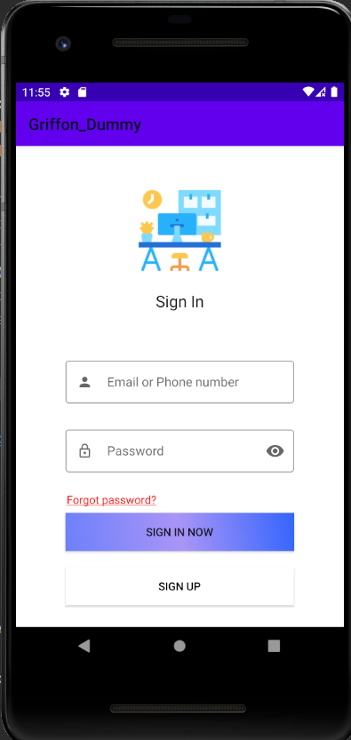
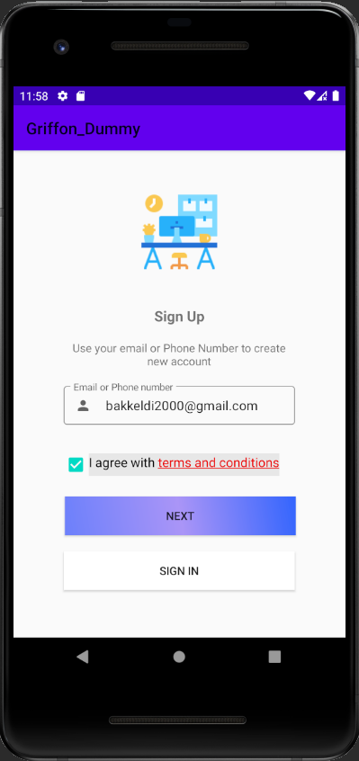
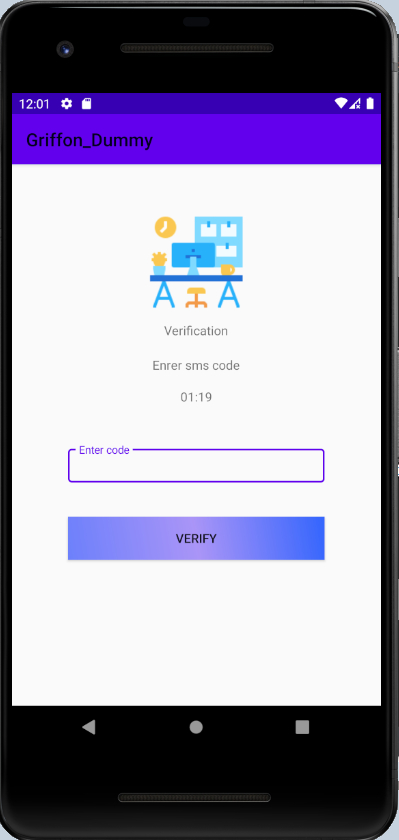

# Griffon_Dummy
## Description
Griffon dummy is a client which used for authorization called Griffon.It can be used in any project.
Our software can be connected as library to any project, which will used Griffon for authorization.
#User
## Some screenshots from an app
# SignIn Fragment
 
# SignUp Fragment
 
# SmsVerification Fragment
 

